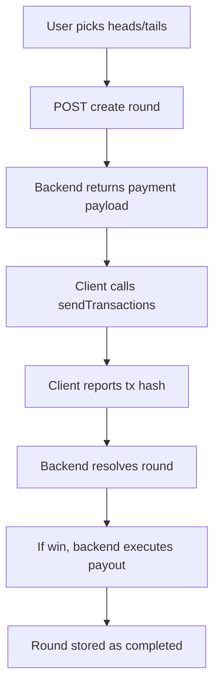

# Circles MiniApp Development Guide

> MiniApps are standalone HTML/JS/CSS applications that run inside iframes, communicating with the host wallet via a postMessage bridge. They enable rich functionality whilst maintaining security through iframe sandboxing, and allow users to leverage their existing Gnosis App passkeys.

---

## 0. Agent Quick-Start

**This guide is the technical reference.** If you are an agent building a miniapp autonomously, follow this order:

1. Read `AGENT.md` at the repo root — it is the complete autonomous build workflow
2. Use `scripts/new-miniapp.sh <slug>` to scaffold a new miniapp
3. Build inside `examples/<slug>/` following the patterns in this guide
4. Use `scripts/deploy-miniapp.sh <slug>` to deploy to Vercel
5. Register in `static/miniapps.json`

**Repo**: `github.com/shorn-gnosis/circles-miniapps-for-agents`

**SDK note**: The MiniApp SDK is always the **local file** `./miniapp-sdk.js` — it is never an npm package. Copy it from `examples/miniapp-sdk.js` into your miniapp folder.

---

## 1. Overview & User Journey

The user journey is as follows:

1. User lands at https://circles.gnosis.io/miniapps
2. Opens an app already listed, or loads a locally hosted app via the advanced tab
3. Logs in and signs transactions using their Gnosis App passkey for the respective app's logic

### What You Need

- A Gnosis App account with a registered Circles v2 human avatar
- The Circles MiniApp SDK (`miniapp-sdk.js`) - a local file postMessage bridge between your MiniApp (running in an iframe) and the host. Copy from `examples/miniapp-sdk.js` — it is never an npm package.
- A Circles Org Account (highly recommended for accepting payments and payouts)

---

## 2. Architecture

```
┌─────────────────────────────────────────────────────────────┐
│  Host App (CirclesMiniapps)                                 │
│  ┌─────────────────────────────────────────────────────┐   │
│  │  Iframe Sandbox                                      │   │
│  │  ┌────────────────────────────────────────────────┐ │   │
│  │  │  Your Miniapp                                  │ │   │
│  │  │                                                 │ │   │
│  │  │  UI Layer → State Machine → Runner Bridge      │ │   │
│  │  │                              ↓ postMessage      │ │   │
│  │  └──────────────────────────────┼──────────────────┘ │   │
│  └─────────────────────────────────┼────────────────────┘   │
│                                    ▼                         │
│  ┌─────────────────────────────────────────────────────┐   │
│  │  Wallet Bridge (Host)                                │   │
│  │  • request_address                                   │   │
│  │  • send_transactions                                 │   │
│  │  • sign_message                                      │   │
│  └─────────────────────────────────────────────────────┘   │
└─────────────────────────────────────────────────────────────┘
                       │
                       ▼
         ┌──────────────────────────────┐
         │  Gnosis Chain (ID 100)       │
         │  • Hub V2                    │
         │  • Safe Contracts            │
         │  • Custom Contracts          │
         └──────────────────────────────┘
```

### Five Core Systems

A miniApp generally comprises:

1. **Client UI** - state, status, and actions
2. **Wallet transaction execution** - via `@aboutcircles/miniapp-sdk`
3. **Backend API** - validation and state machine (can also be replaced by on-chain smart contracts)
4. **Persistent storage** - Supabase, IPFS, etc.
5. **Verification and on-chain payouts** - org-driven

### File Structure

```
examples/your-miniapp/
├── index.html          # Main UI (required)
├── main.js             # Application logic (required)
├── style.css           # Styling (required - use org-manager design system)
├── miniapp-sdk.js      # Host bridge (copy from examples/miniapp-sdk.js)
├── package.json        # Dependencies (required)
├── tsconfig.json       # TypeScript config (optional but recommended)
├── README.md           # Documentation (required)
└── .gitignore          # Ignore node_modules, dist, etc.
```

---

## 3. MiniApp SDK

The SDK provides four capabilities:

- **`isMiniappMode`** - detect whether you're inside the host
- **`onAppData`** - receive host-provided data
- **`onWalletChange`** - react to wallet connect/disconnect
- **`sendTransactions` / `signMessage`** - ask the host to send transactions or sign a message

You don't build, sign, or send like a normal wallet library. You give the host a list of instructions:

```typescript
type Transaction = {
  to: string;      // where to send (contract or wallet)
  data?: string;   // optional calldata for contract calls (0x...)
  value?: string;  // optional native token amount (wei as a string)
}
```

Then call:

```typescript
sendTransactions([tx1, tx2, ...]) -> Promise<string[]> // tx hashes
```

### Import and Setup

```javascript
import { onWalletChange, sendTransactions } from './miniapp-sdk.js';
```

### Wallet Connection

```javascript
onWalletChange(async (address) => {
  if (!address) {
    // Wallet disconnected
    showDisconnectedState();
    return;
  }

  // Wallet connected - address is checksummed
  connectedAddress = getAddress(address);
  await initializeApp();
});
```

---

## 4. Sending Transactions

**Important**: All values must be hex strings (`0x...`). Use the `toHexValue()` helper:

```javascript
function toHexValue(value) {
  return value ? `0x${BigInt(value).toString(16)}` : '0x0';
}

function formatTxForHost(tx) {
  return {
    to: tx.to,
    data: tx.data || '0x',
    value: toHexValue(tx.value || 0n),
  };
}
```

### Native Token Transfer

Send xDAI/ETH to an address:

```javascript
import { sendTransactions } from './miniapp-sdk.js';

const hashes = await sendTransactions([
  {
    to: '0xRecipientAddress',
    value: '10000000000000000', // 0.01 ETH/xDAI in wei
    // no data needed
  },
]);

console.log(hashes);
```

### Contract Call (ERC20 Transfer)

```javascript
import { sendTransactions } from './miniapp-sdk.js';
import { encodeFunctionData, parseUnits } from 'viem';

const erc20Abi = [
  {
    type: 'function',
    name: 'transfer',
    stateMutability: 'nonpayable',
    inputs: [
      { name: 'to', type: 'address' },
      { name: 'amount', type: 'uint256' },
    ],
    outputs: [{ name: '', type: 'bool' }],
  },
] as const;

const token = '0xTokenAddress';
const recipient = '0xRecipientAddress';
const amount = parseUnits('10', 18); // 10 tokens (18 decimals)

const data = encodeFunctionData({
  abi: erc20Abi,
  functionName: 'transfer',
  args: [recipient, amount],
});

const hashes = await sendTransactions([
  { to: token, data, value: '0' },
]);
```

### Batch Multiple Transactions

```javascript
const hashes = await sendTransactions([
  { to: '0xContractA', data: '0xabc...', value: '0' },
  { to: '0xContractB', data: '0xdef...', value: '0' },
]);

console.log(hashes); // array of hashes
```

### Handling Success and Rejection

```javascript
try {
  const hashes = await sendTransactions(txs);
  // success
} catch (e) {
  // user rejected or host rejected
  console.log(e.message); // "Rejected" or reason
}
```

---

## 5. Runner Bridge Pattern

The runner bridge enables Circles SDK usage whilst routing transactions through the host wallet. This is the core pattern for all miniapps.

### Basic Runner (Direct Wallet)

```javascript
function createRunner(address) {
  return {
    address,
    async sendTransaction(txs) {
      const hashes = await sendTransactions(txs.map(formatTxForHost));
      lastTxHashes = hashes;
      const receipts = await waitForReceipts(hashes);
      return receipts[receipts.length - 1];
    },
  };
}

// Usage:
const humanSdk = new Sdk(undefined, createRunner(connectedAddress));
```

### Safe Owner Runner (For Organisation/Safe Operations)

```javascript
function createSafeOwnerRunner(ownerAddress, safeAddress) {
  const safeAbi = safeSingletonDeployment?.abi;
  if (!safeAbi) throw new Error('Safe singleton ABI is unavailable.');

  return {
    address: safeAddress,
    async sendTransaction(txs) {
      const signature = buildPrevalidatedSignature(ownerAddress);

      const safeExecTxs = txs.map((tx) => ({
        to: safeAddress,
        value: 0n,
        data: encodeFunctionData({
          abi: safeAbi,
          functionName: 'execTransaction',
          args: [
            tx.to,
            tx.value ? BigInt(tx.value) : 0n,
            tx.data || '0x',
            0,            // operation (0 = CALL)
            0n,           // safeTxGas
            0n,           // baseGas
            0n,           // gasPrice
            zeroAddress,  // gasToken
            zeroAddress,  // refundReceiver
            signature,
          ],
        }),
      }));

      const hashes = await sendTransactions(safeExecTxs.map(formatTxForHost));
      lastTxHashes = hashes;

      const receipts = await waitForReceipts(hashes);
      receipts.forEach((receipt) =>
        assertSafeExecutionSuccess(receipt, safeAddress, safeAbi)
      );

      return receipts[receipts.length - 1];
    },
  };
}

// Usage:
const orgRunner = createSafeOwnerRunner(connectedAddress, orgSafeAddress);
const orgSdk = new Sdk(undefined, orgRunner);
```

### Helper: Prevalidated Signature

For 1/1 Safe threshold, use prevalidated signatures to bypass signature collection:

```javascript
function buildPrevalidatedSignature(ownerAddress) {
  const ownerPadded = ownerAddress.toLowerCase().replace('0x', '').padStart(64, '0');
  return `0x${ownerPadded}${'0'.repeat(64)}01`;
}
```

### Helper: Assert Safe Execution Success

Always verify Safe execution succeeded:

```javascript
function assertSafeExecutionSuccess(receipt, safeAddress, safeAbi) {
  let sawSuccess = false;

  for (const log of receipt.logs) {
    if (!log.address || log.address.toLowerCase() !== safeAddress.toLowerCase()) continue;

    try {
      const decoded = decodeEventLog({
        abi: safeAbi,
        data: log.data,
        topics: log.topics,
        strict: false,
      });

      if (decoded?.eventName === 'ExecutionFailure') {
        throw new Error('Safe execution failed.');
      }

      if (decoded?.eventName === 'ExecutionSuccess') {
        sawSuccess = true;
      }
    } catch (err) {
      if (err?.message === 'Safe execution failed.') throw err;
    }
  }

  if (!sawSuccess) {
    throw new Error('Safe execution status could not be confirmed.');
  }
}
```

---

## 6. Receipt Handling

### Multi-RPC Polling with UserOp Fallback

Gnosis Chain RPC endpoints can be unreliable, and Account Abstraction wallets use UserOperations that need special handling. The solution is to poll multiple RPCs with EntryPoint event fallback.

```javascript
const RPC_FALLBACK_URLS = [
  'https://rpc.aboutcircles.com/',
  'https://rpc.gnosischain.com',
  'https://1rpc.io/gnosis',
];

const TX_RECEIPT_TIMEOUT_MS = 12 * 60 * 1000;  // 12 minutes
const TX_RECEIPT_POLL_MS = 3000;                // 3 seconds
const USER_OP_LOOKBACK_BLOCKS = 5000n;
const ENTRYPOINT_V07_ADDRESS = '0x0000000071727de22e5e9d8baf0edac6f37da032';

const receiptClients = RPC_FALLBACK_URLS.map((url) =>
  createPublicClient({ chain: gnosis, transport: http(url) })
);

async function waitForReceiptFromAnyRpc(hash) {
  const deadline = Date.now() + TX_RECEIPT_TIMEOUT_MS;
  let round = 0;

  while (Date.now() < deadline) {
    round += 1;

    // Try standard receipt from each RPC
    for (const client of receiptClients) {
      try {
        const receipt = await client.getTransactionReceipt({ hash });
        if (receipt) return receipt;
      } catch {}
    }

    // Every 2nd round, try UserOp resolution
    if (round % 2 === 0) {
      for (const client of receiptClients) {
        const receipt = await tryResolveUserOpReceipt(client, hash);
        if (receipt) return receipt;
      }
    }

    await sleep(TX_RECEIPT_POLL_MS);
  }

  throw new Error(`Timed out waiting for tx ${hash}`);
}

async function tryResolveUserOpReceipt(client, userOpHash) {
  try {
    const latest = await client.getBlockNumber();
    const fromBlock = latest > USER_OP_LOOKBACK_BLOCKS
      ? latest - USER_OP_LOOKBACK_BLOCKS
      : 0n;

    const logs = await client.getLogs({
      address: ENTRYPOINT_V07_ADDRESS,
      event: parseAbiItem('event UserOperationEvent(...)'),
      args: { userOpHash },
      fromBlock,
      toBlock: latest,
    });

    if (logs.length > 0) {
      const txHash = logs[logs.length - 1].transactionHash;
      return await client.getTransactionReceipt({ hash: txHash });
    }
    return null;
  } catch {
    return null;
  }
}
```

---

## 7. Circles SDK Integration

### Installation

```json
{
  "dependencies": {
    "@aboutcircles/sdk": "^0.1.24",
    "@aboutcircles/sdk-utils": "^0.1.24",
    "viem": "^2.46.3"
  }
}
```

### Profile Operations

```javascript
// Pin profile metadata (returns CID)
const profile = { name: 'My Org', description: 'Description here' };
const profileCid = await sdk.profiles.create(profile);
const metadataDigest = cidV0ToHex(profileCid);  // For on-chain registration

// Update on-chain profile via NameRegistry v2
// Contract: 0xA27566fD89162cC3D40Cb59c87AAaA49B85F3474
// Function: updateMetadataDigest(bytes32)

// Fetch profile by address
const profile = await sdk.rpc.profile.getProfileByAddress(address);
const name = profile?.name || profile?.registeredName;

// Search profiles
const results = await sdk.rpc.profile.searchByAddressOrName(query, limit, offset);
```

**⚠️ Profile Field Limitation**: The SDK only persists these fields: `name`, `description`, `previewImageUrl`, `imageUrl`, `location`, `geoLocation`. The `extensions` field exists in TypeScript types but is NOT persisted. Store custom data as JSON in `location` field if needed.

### Trust Operations

**For avatars/groups** (use SDK methods):

```javascript
const avatar = await sdk.getAvatar(address);
await avatar.trust.add(trusteeAddress);
await avatar.trust.remove(trusteeAddress);
```

**For payment gateways** (call contract directly):

```javascript
const GATEWAY_TRUST_ABI = [{
  type: 'function',
  name: 'setTrust',
  inputs: [
    { name: 'trustReceiver', type: 'address' },
    { name: 'expiry', type: 'uint96' }
  ]
}];

const TRUST_EXPIRY_MAX = (1n << 96n) - 1n;

// Add trust
const data = encodeFunctionData({
  abi: GATEWAY_TRUST_ABI,
  functionName: 'setTrust',
  args: [trustReceiverAddress, TRUST_EXPIRY_MAX],
});

const runner = createSafeOwnerRunner(ownerAddress, orgSafeAddress);
await runner.sendTransaction([{ to: gatewayAddress, data, value: 0n }]);

// Remove trust (set expiry to 0)
const data = encodeFunctionData({
  abi: GATEWAY_TRUST_ABI,
  functionName: 'setTrust',
  args: [trustReceiverAddress, 0n],
});
```

### Balance Operations

```javascript
const avatar = await sdk.getAvatar(address);
const balances = await avatar.balances.getTokenBalances();

const totalAttoCircles = balances.reduce((sum, balance) => {
  const amount = balance?.attoCircles !== undefined
    ? BigInt(balance.attoCircles)
    : 0n;
  return sum + (amount > 0n ? amount : 0n);
}, 0n);

// Transfer CRC
await avatar.transfer.advanced(recipientAddress, amountInAttoCircles);
```

### Query Trust Relations

```javascript
const relations = await sdk.data.getTrustRelations(address);
```

### Organisation Registration

```javascript
// 1. Pin profile
const profileCid = await sdk.profiles.create({ name, description });
const metadataDigest = cidV0ToHex(profileCid);

// 2. Register org (from Safe, not EOA)
const registerTx = sdk.core.hubV2.registerOrganization(name, metadataDigest);

// 3. Send via Safe runner
const runner = createSafeOwnerRunner(ownerAddress, safeAddress);
await runner.sendTransaction([registerTx]);
```

---

## 8. CirclesRPC Query Patterns

### Query Structure

```javascript
const response = await sdk.circlesRpc.call('circles_query', [{
  Namespace: 'CrcV2_PaymentGateway',
  Table: 'GatewayCreated',
  Columns: ['gateway', 'owner', 'timestamp', 'blockNumber'],
  Filter: [
    {
      Type: 'FilterPredicate',
      FilterType: 'Equals',  // or 'GreaterThan', 'LessThan', etc.
      Column: 'owner',
      Value: address.toLowerCase()
    }
  ],
  Order: []  // Optional: [{ Column: 'blockNumber', SortOrder: 'DESC' }]
}]);

const cols = response?.result?.columns || [];
const rows = response?.result?.rows || [];

// Extract data by column index
const gatewayIdx = cols.indexOf('gateway');
const results = rows.map(row => row[gatewayIdx]);
```

### Available Namespaces

- `CrcV2` - Hub V2 events (trust, transfers, etc.)
- `CrcV2_PaymentGateway` - Gateway events (GatewayCreated, TrustUpdated)
- `CrcV2_Groups` - Group events
- `CrcV2_Organizations` - Organisation events

### Common Queries

**Find gateways by owner:**

```javascript
// Namespace: 'CrcV2_PaymentGateway', Table: 'GatewayCreated'
// Columns: ['gateway', 'timestamp', 'blockNumber']
// Filter: [{ Column: 'owner', Value: ownerAddress.toLowerCase() }]
```

**Find gateway trust relations:**

```javascript
// Namespace: 'CrcV2_PaymentGateway', Table: 'TrustUpdated'
// Columns: ['trustReceiver', 'expiry', 'blockNumber']
// Filter: [{ Column: 'gateway', Value: gatewayAddress.toLowerCase() }]
```

---

## 9. Common Patterns

### Organisation Creation (Batched)

```javascript
// 1. Pin profile
const profileCid = await humanSdk.profilesClient.create({ name, description });
const metadataDigest = cidV0ToHex(profileCid);

// 2. Predict Safe address
const saltNonce = randomSaltNonce();
const setupData = encodeFunctionData({
  abi: safeAbi,
  functionName: 'setup',
  args: [
    [ownerAddress], 1n, zeroAddress, '0x',
    fallbackHandler, zeroAddress, 0n, zeroAddress
  ]
});

const deploySafeData = encodeFunctionData({
  abi: proxyFactoryAbi,
  functionName: 'createProxyWithNonce',
  args: [safeSingletonAddress, setupData, BigInt(saltNonce)]
});

const preflight = await publicClient.call({
  to: proxyFactoryAddress,
  data: deploySafeData,
  account: ownerAddress
});

const predictedSafe = getAddress(
  decodeFunctionResult({
    abi: proxyFactoryAbi,
    functionName: 'createProxyWithNonce',
    data: preflight.data
  })
);

// 3. Build org registration tx (FROM predicted Safe)
const registerTx = sdk.core.hubV2.registerOrganization(name, metadataDigest);
const safeExecData = encodeFunctionData({
  abi: safeAbi,
  functionName: 'execTransaction',
  args: [
    registerTx.to, registerTx.value || 0n, registerTx.data || '0x',
    0, 0n, 0n, 0n, zeroAddress, zeroAddress,
    buildPrevalidatedSignature(ownerAddress)
  ]
});

// 4. Batch deploy + register (single approval)
const txHashes = await sendTransactions([
  { to: proxyFactoryAddress, data: deploySafeData, value: 0n },
  { to: predictedSafe, data: safeExecData, value: 0n }
]);
```

### Event Parsing from Receipts

```javascript
function deriveAddressFromReceipt(receipt, contractAddress, eventAbi) {
  for (const log of receipt.logs) {
    if (log.address.toLowerCase() !== contractAddress.toLowerCase()) continue;

    try {
      const decoded = decodeEventLog({
        abi: [eventAbi],
        data: log.data,
        topics: log.topics,
        strict: false
      });

      if (decoded?.eventName === 'YourEvent') {
        return getAddress(decoded.args.yourAddress);
      }
    } catch {}
  }
  return null;
}
```

### State Machine Pattern

Use section visibility toggling to manage UI states:

```javascript
const loginSection = document.getElementById('login-section');
const dashboardSection = document.getElementById('dashboard-section');

function hideAllSections() {
  loginSection.classList.add('hidden');
  dashboardSection.classList.add('hidden');
}

function showDashboard() {
  hideAllSections();
  dashboardSection.classList.remove('hidden');
}

onWalletChange(async (address) => {
  if (!address) {
    showDisconnectedState();
  } else {
    await loadDashboard();
  }
});
```

### Error Handling

```javascript
function decodeError(err) {
  if (!err) return 'Unknown error';
  if (typeof err === 'string') return err;
  if (err.shortMessage) return err.shortMessage;
  if (err.message) return err.message;
  return String(err);
}

function isPasskeyAutoConnectError(err) {
  const message = decodeError(err).toLowerCase();
  return message.includes('passkey') ||
         message.includes('auto connect') ||
         (message.includes('wallet address') && message.includes('retrieve'));
}

// Usage
try {
  await someOperation();
} catch (err) {
  if (isPasskeyAutoConnectError(err)) {
    showResult('error',
      'Passkey auto-connect failed. Re-open wallet connect and choose your wallet again.'
    );
  } else {
    showResult('error', `Operation failed: ${decodeError(err)}`);
  }
}
```

---

## 10. Automated Payouts & Org Accounts

Any miniApp that wants to implement automated payouts should use its own unique Circles org account, which can be created and managed using the org manager app: https://circles.gnosis.io/miniapps/miniapps-org-manager

For automated payouts:

1. Create an org using the org manager app
2. Create a new EOA (using a wallet) and connect it to your org as a signer
3. Fund the EOA from the org manager app
4. Use the EOA's private key in your backend to sign payout transactions

Keep secrets off the client completely - private keys only in secure server environments, or use a contract escrow model.

---

## 11. IPFS Integration

### Pinning Content

```javascript
// Using Circles SDK (recommended)
const profileCid = await sdk.profilesClient.create({
  name: 'Content title',
  description: 'Content body',
  imageUrl: 'https://...' // optional
});

// Convert to hex for on-chain storage
const metadataDigest = cidV0ToHex(profileCid);
```

### Fetching Content

```javascript
const profile = await sdk.rpc.profile.getProfileByAddress(address);
const { name, description, imageUrl } = profile;
```

For custom content beyond profiles, you may need to implement direct IPFS pinning. Reference the main app's `circles-app/src/lib/areas/market/offers/client.ts` for examples.

---

## 12. Design System

All miniapps should use the org-manager design system for visual consistency.

### Google Fonts

Always include in `<head>`:

```html
<link rel="preconnect" href="https://fonts.googleapis.com">
<link rel="preconnect" href="https://fonts.gstatic.com" crossorigin>
<link href="https://fonts.googleapis.com/css2?family=Space+Grotesk:wght@400;500;600;700&display=swap" rel="stylesheet">
<link href="https://fonts.googleapis.com/css2?family=JetBrains+Mono:wght@400;500&display=swap" rel="stylesheet">
```

### CSS Variables

```css
:root {
  --bg-a: #f3f7ff;
  --bg-b: #fcf8f3;
  --ink: #1a2340;
  --muted: #6e7694;
  --card: #ffffff;
  --line: #d8deef;
  --line-soft: #e6eaf6;
  --accent: #0f4ad7;
  --accent-soft: #e7efff;
  --success-bg: #effdf2;
  --success-line: #b7efc2;
  --success-ink: #157a2f;
  --warn-bg: #fff9ea;
  --warn-line: #f8e4b3;
  --warn-ink: #975a16;
  --error-bg: #fff1f1;
  --error-line: #ffcaca;
  --error-ink: #b42318;
}
```

### Typography

```css
body {
  font-family: "Space Grotesk", "Avenir Next", "Segoe UI", sans-serif;
  color: var(--ink);
  background:
    radial-gradient(1200px 500px at 0% 0%, #e7f0ff 0%, transparent 65%),
    radial-gradient(900px 500px at 100% 20%, #fff0dc 0%, transparent 70%),
    linear-gradient(145deg, var(--bg-a), var(--bg-b));
}

h1 {
  margin: 0;
  letter-spacing: -0.02em;
  font-size: 30px;
  line-height: 1.1;
}

h2 {
  margin: 22px 0 10px;
  font-size: 15px;
  text-transform: uppercase;
  letter-spacing: 0.08em;
  color: var(--muted);
}
```

### Core Components

```css
.app-shell {
  max-width: 720px;
  margin: 0 auto;
}

.card {
  background: rgba(255, 255, 255, 0.92);
  backdrop-filter: blur(6px);
  border: 1px solid var(--line);
  border-radius: 22px;
  padding: 22px;
  box-shadow:
    0 8px 30px rgba(26, 35, 64, 0.08),
    inset 0 1px 0 #ffffff;
}

.title-row {
  display: flex;
  align-items: center;
  justify-content: space-between;
  gap: 12px;
}

.field {
  margin-top: 10px;
}

.field label {
  display: block;
  margin-bottom: 6px;
  color: var(--muted);
  font-size: 12px;
  letter-spacing: 0.06em;
  text-transform: uppercase;
}

.field input {
  width: 100%;
  border-radius: 11px;
  border: 1px solid var(--line-soft);
  background: #ffffff;
  color: var(--ink);
  padding: 11px 12px;
  font-family: "JetBrains Mono", "SF Mono", "Menlo", monospace;
}

button {
  width: 100%;
  border: 0;
  border-radius: 999px;
  padding: 12px 16px;
  background: linear-gradient(130deg, var(--accent), #1f6bff);
  color: #ffffff;
  font-weight: 600;
  font-size: 14px;
  cursor: pointer;
}

button:disabled {
  opacity: 0.5;
  cursor: not-allowed;
}

.btn-secondary {
  background: #ffffff;
  border: 1px solid var(--line);
  color: var(--ink);
}

.badge {
  border-radius: 999px;
  border: 1px solid;
  padding: 5px 10px;
  font-size: 12px;
  font-weight: 600;
}

.badge-success {
  background: var(--success-bg);
  border-color: var(--success-line);
  color: var(--success-ink);
}
```

### Reference Files

- **Full CSS**: `examples/vendor-offer-setup/style.css`
- **HTML structure**: `examples/vendor-offer-setup/index.html`

---

## 13. Constants & Addresses

### Gnosis Chain (Chain ID 100)

```javascript
const CHAIN_ID = 100;
const RPC_URL = 'https://rpc.aboutcircles.com/';
const HUB_V2_ADDRESS = '0xc12C1E50ABB450d6205Ea2C3Fa861b3B834d13e8';
const GATEWAY_FACTORY_ADDRESS = '0x186725D8fe10a573DC73144F7a317fCae5314F19';
const ENTRYPOINT_V07_ADDRESS = '0x0000000071727de22e5e9d8baf0edac6f37da032';
const SAFE_SENTINEL_OWNERS = '0x0000000000000000000000000000000000000001';
const SAFE_VERSION = '1.4.1';
const SAFE_TX_SERVICE_URL = 'https://safe-transaction-gnosis-chain.safe.global';
```

### Safe Deployments

```javascript
import {
  getSafeSingletonDeployment,
  getProxyFactoryDeployment,
  getCompatibilityFallbackHandlerDeployment,
} from '@safe-global/safe-deployments';

const safeSingletonDeployment = getSafeSingletonDeployment({
  network: '100',
  version: '1.4.1'
});

function getDeploymentAddress(deployment) {
  if (!deployment) throw new Error('Deployment metadata missing.');
  const addr = deployment.networkAddresses?.['100'] || deployment.defaultAddress;
  if (!addr) throw new Error('Deployment address not found.');
  return getAddress(addr);
}
```

---

## 14. Practical Example: Heads or Tails

- **Live example**: https://circles.gnosis.io/miniapps/coinflip-game
- **Source code**: https://github.com/aboutcircles/circles-gnosisApp-starter-kit/tree/coinflip-miniapp

### App Lifecycle



### MiniApp Design Principles

1. Start with one clear loop: connect wallet -> start round -> pay -> resolve -> show result
2. Define a strict state machine first (awaiting_payment, resolving, completed) and enforce transitions on backend/contract only
3. Keep payment logic server-side (or contract-side), not UI-side; the client should only execute returned transactions
4. Validate MiniApp SDK payloads before sending: `to` address, `data` hex, `value` hex (`0x...`)
5. Make settlement idempotent so retries cannot create duplicate payouts
6. Treat timeouts as "unknown," not failure; poll and reconcile with chain events/history
7. Store full round audit data (roundId, player, txHash, status changes, timestamps) for debugging and support
8. Add DB constraints early (e.g. one active round per player) to prevent race-condition bugs
9. Show economics clearly in UI (entry fee, reward, and outcome rules) before users tap
10. Design failure UX carefully: rejected signature, delayed confirmation, and retry/resume flows
11. Keep secrets off client completely; private keys only in secure server env or use a contract escrow model
12. Ship in phases: UI mock -> API + DB -> tx send -> verification -> payout -> monitoring

---

## 15. Development Workflow

### Initial Setup

1. Create folder in `examples/your-miniapp/`
2. Copy `examples/miniapp-sdk.js` into your miniapp folder
3. Create `package.json`:

```json
{
  "name": "your-miniapp",
  "version": "1.0.0",
  "type": "module",
  "scripts": {
    "dev": "vite",
    "build": "vite build"
  },
  "dependencies": {
    "@aboutcircles/sdk": "^0.1.24",
    "@aboutcircles/sdk-utils": "^0.1.24",
    "viem": "^2.46.3"
  },
  "devDependencies": {
    "vite": "^6.0.0"
  }
}
```

4. Run `npm install`
5. Start dev server: `npm run dev`
6. Test standalone at `http://localhost:5173/`

### Full Host Testing

To test inside the host app with wallet connection:

1. **Set up SSL certificates** (required for passkey):
   ```bash
   mkcert -install
   mkcert circles.gnosis.io
   ```

2. **Configure host** in the `CirclesMiniapps` workspace: copy cert files to root, update `vite.config.ts` with cert paths, and add an entry to `/etc/hosts`: `127.0.0.1 circles.gnosis.io`

3. **Run host**: `npm run dev`

4. **Access**: `https://circles.gnosis.io:5173/miniapps`

### Deployment to Vercel

```bash
cd examples/your-miniapp
vercel --prod
```

**Important**: Ensure Deployment Protection is disabled in Vercel settings, or the miniapp won't load in the iframe due to 401/SSO.

### Register in Marketplace

Add an entry to `static/miniapps.json`:

```json
{
  "slug": "your-miniapp",
  "name": "Your Miniapp Name",
  "logo": "https://...",
  "url": "https://your-miniapp-xxx.vercel.app",
  "description": "Brief description of what it does",
  "tags": ["tag1", "tag2"]
}
```

---

## 16. Quick Start Template

```javascript
import { onWalletChange, sendTransactions } from './miniapp-sdk.js';
import { Sdk } from '@aboutcircles/sdk';
import { getAddress, encodeFunctionData } from 'viem';

let connectedAddress = null;
let sdk = null;

const badge = document.getElementById('badge');
const resultEl = document.getElementById('result');

function showResult(type, html) {
  resultEl.className = `result result-${type}`;
  resultEl.innerHTML = html;
  resultEl.classList.remove('hidden');
}

function createRunner(address) {
  return {
    address,
    async sendTransaction(txs) {
      const hashes = await sendTransactions(txs.map(tx => ({
        to: tx.to,
        data: tx.data || '0x',
        value: `0x${BigInt(tx.value || 0n).toString(16)}`
      })));
      return { hash: hashes[0] };
    }
  };
}

onWalletChange(async (address) => {
  if (!address) {
    connectedAddress = null;
    sdk = null;
    badge.textContent = 'Not connected';
    badge.className = 'badge badge-disconnected';
    return;
  }

  connectedAddress = getAddress(address);
  sdk = new Sdk(undefined, createRunner(connectedAddress));
  badge.textContent = 'Connected';
  badge.className = 'badge badge-success';

  try {
    await loadAppState();
  } catch (err) {
    showResult('error', `Initialisation failed: ${err.message}`);
  }
});

async function loadAppState() {
  // Your app logic here
}
```

---

## 17. Testing Checklist

- [ ] Standalone dev server works (`npm run dev`)
- [ ] Wallet connection/disconnection handled gracefully
- [ ] All user flows tested (happy path + error cases)
- [ ] Passkey auto-connect failure handled
- [ ] Receipt polling works with timeout handling
- [ ] Safe execution success verified
- [ ] Styling matches org-manager design system
- [ ] Mobile responsive (test at 560px width)
- [ ] README documentation complete
- [ ] Registered in `static/miniapps.json`
- [ ] Deployed to Vercel with Deployment Protection disabled
- [ ] Verified iframe embedding works (no X-Frame-Options blocking)

---

## 18. Best Practices

### Do

- Use the runner bridge pattern for SDK integration
- Implement proper receipt polling with timeout handling
- Verify Safe execution success from event logs
- Handle passkey auto-connect errors explicitly
- Use the org-manager design system for styling
- Add Google Fonts (Space Grotesk, JetBrains Mono)
- Provide clear error messages with recovery guidance
- Test on mobile (responsive at 560px)
- Document all flows in README
- Create specs in `.context/specs/` for complex miniapps
- Normalise addresses with `getAddress()`
- Validate MiniApp SDK payloads before sending
- Make settlement idempotent
- Store full round audit data for debugging
- Ship in phases

### Don't

- Assume transaction success without checking receipts
- Use `avatar.trust.add()` for gateway trust (call `setTrust()` directly instead)
- Forget to normalise addresses with `getAddress()`
- Deploy without disabling Vercel Deployment Protection
- Hardcode RPC URLs without fallbacks
- Skip Safe execution verification
- Assume a single RPC endpoint will work reliably
- Keep secrets on the client
- Treat timeouts as failures - poll and reconcile instead

---

## 19. Troubleshooting

### Miniapp won't load in iframe
- Check Vercel Deployment Protection is disabled
- Verify no `X-Frame-Options: deny` header: `curl -I <url> | grep -i frame`
- Ensure HTTPS is configured if testing locally

### SDK methods fail
- Verify runner is properly created with `createRunner()` or `createSafeOwnerRunner()`
- Check network is Gnosis Chain (ID 100)
- Confirm wallet is connected

### Transactions fail silently
- Check Safe execution logs with `assertSafeExecutionSuccess()`
- Verify signature format for prevalidated signatures
- Ensure transaction data is properly encoded

### Gateway operations fail
- Confirm you're calling `gateway.setTrust()`, not `avatar.trust.add()`
- Verify transaction goes through org Safe: Wallet -> Org Safe -> Gateway
- Check gateway address is set correctly

### Trust operations fail with "not authorised"
- Ensure you're calling trust operations from the correct context: avatars/groups use `avatar.trust.add()`, gateways use `gateway.setTrust()` directly via Safe runner

### Receipt polling times out
- Verify all RPC fallback URLs are accessible
- Check UserOp event parsing for AA wallets
- Consider increasing timeout for complex operations
- Consider showing "confirmed on-chain" message if state is verifiable despite timeout

### Passkey auto-connect fails
- Detect via `isPasskeyAutoConnectError()`
- Show specific message: "Re-open wallet connect and choose your wallet again"
- Don't retry automatically - the user must manually reconnect

### Styling doesn't match other miniapps
- Copy `style.css` from `examples/vendor-offer-setup/` and adapt as needed

---

## 20. Reference Examples

### Minimal Miniapp (Sign Demo)
- **Path**: `examples/sign-demo/`
- **Patterns**: Basic postMessage bridge, simple UI

### Complex Miniapp (Vendor Offer Setup)
- **Path**: `examples/vendor-offer-setup/`
- **Patterns**: Runner bridge with Safe operations, multi-step flow with state machine, CirclesRPC queries, gateway trust management, profile pinning, receipt polling

### Specification Template
- **Path**: `.context/specs/vendor-offer-setup-miniapp/`
- **Files**: `requirements.md`, `design.md`, `tasks.md`

| Pattern | Reference File |
|---------|----------------|
| Basic postMessage bridge | `examples/sign-demo/main.js` |
| Complex multi-step flow | `examples/tx-demo/main.js` |
| Runner bridge creation | This guide, Section 5 |
| Receipt polling | This guide, Section 6 |
| Safe operations | This guide, Section 5 (createSafeOwnerRunner) |
| Design system CSS | This guide, Section 12 |

### Documentation

- **Circles SDK**: Check `node_modules/@aboutcircles/sdk/` for method signatures
- **Safe SDK**: `node_modules/@safe-global/safe-deployments/` for ABIs
- **Viem docs**: https://viem.sh/

---

## 21. VibeCoding Steps (For Non-Technical People)

1. Figure out why you want to build. It's often a good idea to map out the tech stack and logic flow in a structured output before beginning your vibe-coding session, then use that output to begin the session.
2. Use this repo as your base: https://github.com/aboutcircles/circles-gnosisApp-starter-kit/tree/coinflip-miniapp
3. If you require automated payouts, create a dedicated org for your app using the [org manager app](https://circles.gnosis.io/miniapps/miniapps-org-manager)
4. If you require automated payouts, create a new EOA (using a wallet), connect it to your org as a signer, and fund it from the app
5. Update the private key in your fork of the repo/settings
6. Copy this guide into the context of your favourite tool

---

## 22. Next Steps for New Miniapps

When starting a new miniapp:

1. **Read `AGENT.md`** — it is the complete autonomous build workflow for this repo
2. **Scaffold** with `scripts/new-miniapp.sh <slug>` — creates the correct folder structure and copies `miniapp-sdk.js` automatically
3. **Create spec** in `.context/specs/<slug>/`: `requirements.md`, `design.md`, `tasks.md`
4. **Adapt patterns**: keep the runner bridge, keep receipt polling, adapt the state machine to your flow, keep org-manager styling
5. **Test thoroughly** before deployment
6. **Deploy** with `scripts/deploy-miniapp.sh <slug>` and register in `static/miniapps.json`